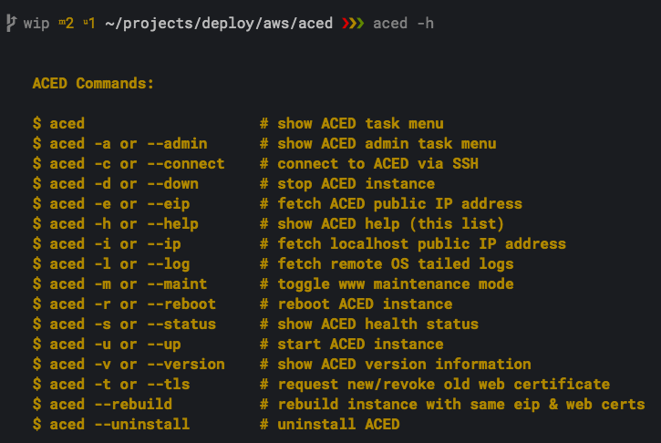
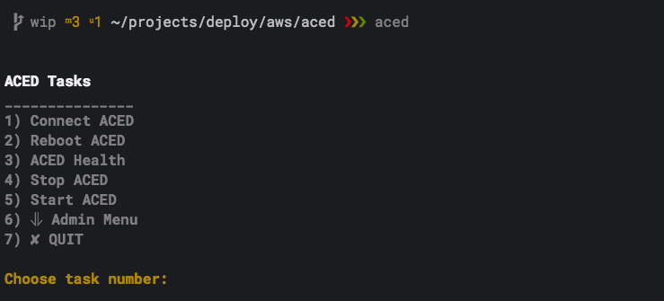
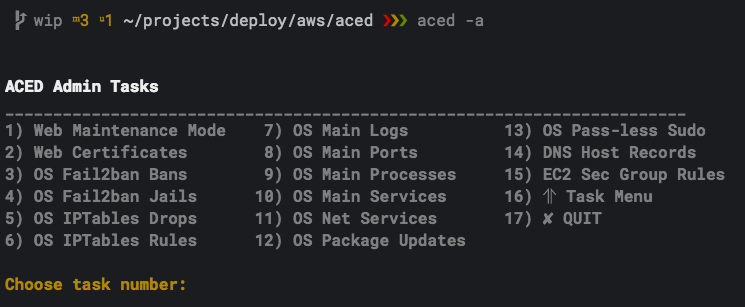

<h1>  DevOps /etc</h1>

## ACED: AWS Cloud Easy Deploy

ACED is a highly opinionated, yet user configurable, EC2 instance generator and SysAdmin helper... an EC2 instance in an instant! This project uses a series of bash shell scripts that tap into the AWS API via the aws-cli tool to quickly deploy a secure and lightweight cloud environment. Ideal for serving up websites built by static site generators, such as [Hugo](https://gohugo.io/), [Hexo](https://hexo.io/) or [Jekyll](https://jekyllrb.com/), yet flexible enough to install the run-time of your choice for web apps.

Code walkthrough and additional information can be found at:  [DevOpsEtc.com/post/aced](https://DevOpsEtc.com/post/aced)

**Features/Benefits:**
  * Automated for fast builds/teardowns (often within 5 minutes)
  * Idempotent to protect against duplication
  * Automatic disassociation/disassociation of EIP address during EC2 instance rebuild/stop/start
  * Automatic reuse of web certificate for rebuilds
  * IP address checker/automatic EC2 rule updater for new SSH connections
  * Non-destructive installer prompts before removing anything
  * Canned CLI monitoring and admin tools for quicker tasks
  * CLI-based to save you from having to use AWS web console
  * Free for 1st year (if you qualify for AWS free-tier)

**Prerequisites:**
  * MacOS or Linux with some tweaking, i.e. some bash commands are not fully POSIX compliant
  * Register for free AWS account:
    * Read [AWS Free Tier Details](https://aws.amazon.com/free)
    * Create an [AWS Account](https://console.aws.amazon.com/console/home)
    * Enter your email address and select "I am a new user"
    * On the next form fill in your contact information
    * Note: account validation requires receiving a phone call and entering a pin
  * Install aws-cli for AWS API access:
    * via brew: $ brew install awscli OR
    * via pip: see [cli userguide](http://docs.aws.amazon.com/cli/latest/userguide/cli-install-macos.html)      
  * Create unique passwords (and securely store) for:
    * Private/public key pair for remote access (5 character minimum)
    * Operating system user account
    * Staging subdomain access
  * Register a domain name (if you don't already have one), e.g. [NameCheap](https://www.namecheap.com/)

**What Gets Provisioned: AWS Infrastructure**
  * One IAM Group
  * One IAM Group Policy
  * One IAM User
  * One IAM User Access Keys
  * One EC2 Instance
    - AMI: Ubuntu Server 16.04 LTS
    - Region: us-west-1
    - Type: t2.micro
    - EBS Volume: 30GB
  * One EC2 Key Pair
  * One EC2 Elastic IP
  * One EC2 Security Group
    - Default ingress/egress rules removed
    - New ingress/egress rules added:
      - DHCP (port: 67:68)
      - DNS (port: 53)
      - echo (port: 8-1)
      - HTTP (port: 80)
      - HTTPS (port: 443)
      - NTP (port: 123)
      - rsync (port: 873)
      - SSH (port: 22??, subnet mask 32)
      - whois (port: 43)

**What Gets Provisioned: Ubuntu Server**
  * One non-root user with sudo capabilities
  * SSH access restricted to key pair
  * Automatic security updating
  * Stateful packet filtering firewall with IPTables
    * Input/Output rules for same connections as EC2 rules
    * Dropped connections get logged
    * Default policy chains set
  * Apps Installed:
    * Nginx: HTTP server:
      * testing/staging server block (with auth basic)
      * production server block
      * 301 redirects for naked domain and https
    * TLS bundled certificate via Let's Encrypt
    * Fail2ban: log monitoring/IP banning
    * Tree: recursive directory listing
    * Htop: prettier alternative to top
    * Certbot: client for certificate authority
    * Iptables-persistent: persist loading of IPTables rules
  * Cron job to automate check/renewal of TLS certificate

**What Gets Provisioned: Local**
  * Known host entry added for EC2's EIP address: ~/.ssh/known_hosts
  * SSH config entry added for EC2's EIP address: ~/.ssh/ssh_config
  * Bash alias created in ~/bash_profile, pointing to ~/aced/app/aced.sh
  * Any existing aws-cli and/or ssh config saved to ~/aced/config/backups
  * EC2 public/private key pair created at ~/aced/config/keys
  * Copy of remote host's TLS certificates downloaded to ~/aced/config/certs
  * SSH Agent entry added for private key passphrase
  * Post-install directory structure:

        $ tree ~/aced

        /Users/your_user/aced
        ├── app -> /Users/your_user/src/deploy/cloud/aws
        │   ├── LICENSE-MIT.txt
        │   ├── README.md
        │   ├── aced.sh
        │   ├── aws.sh
        │   ├── build
        │   │   ├── html
        │   │   ├── jail.local
        │   │   ├── rules.v4
        │   │   └── server_block
        │   ├── config.sh
        │   ├── ec2.sh
        │   ├── ec2_health.sh
        │   ├── ec2_sec.sh
        │   ├── iam.sh
        │   ├── misc.sh
        │   ├── os_app.sh
        │   ├── os_misc.sh
        │   └── os_sec.sh
        └── config
            ├── backups
            │   ├── aws
            │   └── ssh
            ├── certs
            │   └── 04-27-2017_13-59
            │       ├── archive
            │       │   └── your_domain
            │       │       ├── cert1.pem
            │       │       ├── cert2.pem
            │       │       ├── cert3.pem
            │       │       ├── chain1.pem
            │       │       ├── chain2.pem
            │       │       ├── chain3.pem
            │       │       ├── fullchain1.pem
            │       │       ├── fullchain2.pem
            │       │       ├── fullchain3.pem
            │       │       ├── privkey1.pem
            │       │       ├── privkey2.pem
            │       │       └── privkey3.pem
            │       ├── live
            │       │   └── your_domain
            │       │       ├── README
            │       │       ├── cert.pem -> ../../archive/your_domain/cert3.pem
            │       │       ├── chain.pem -> ../../archive/your_domain/chain3.pem
            │       │       ├── fullchain.pem -> ../../archive/your_domain/fullchain3.pem
            │       │       └── privkey.pem -> ../../archive/your_domain/privkey3.pem
            │       └── renewal
            │           └── your_domain.conf
            └── keys
                ├── aced_key
                └── aced_key.pub

        14 directories, 37 files

**Installation:**

    # Clone the ACED repo on GitHub
    $ git clone https://github.com/DevOpsEtc/aced ~/aced/app

    # Update these default values (inside quotes) at ~/aced/app/config.sh
    os_fqdn="yourdomain.com"               # domain name
    os_fqdn_title="YourDomain.com"         # domain name in title-case
    os_fqdn_dev="dev.$os_fqdn"             # staging subdomain
    os_fqdn_dev_title="Dev.$os_fqdn_title" # staging subdomain in title-case
    os_user_email="You@$os_fqdn"           # used for cerbot EFF contact and fail2ban

    # OPTIONAL: Update these other default values
    down1="$HOME/Desktop"                  # search path: downloaded EC2 keys
    down2="$HOME/Downloads"                # 2nd search path: downloaded EC2 keys
    aws_region="us-west-1"                 # aws-cli default region
    os_user="ace"                          # host account username
    os_ssh_port="2222"                     # SSH listen port; only for cleaner logs
    os_hostname="YourHostName"             # hostname; seen in ssh prompt

    # Run the ACED installer script
    $ ~/aced/app/aced.sh

    # Complete both post-install steps

**Post-Installation:**

  1. Update your DNS host records (website not reachable by domain name until you do this):
    1. Fetch your instance's public EIP address: $ aced --eip
    2. Go to your domain registrar
    3. Create 3 DNS host records:
        Type: A Record
        Host: (@, www, dev)
        Value: Your instance's EIP
        TTL: 5 min (change to 60 min after propagation)
    4. Check on DNS propagation: [viewdns.info](http://viewdns.info/propagation)
    5. If NameCheap is your domain registrar see this [tutorial](https://www.namecheap.com/support/knowledgebase/article.aspx/434/2237/how-do-i-set-up-host-records-for-a-domain)
  2. Run SSL/TLS certificate request and Nginx config update:

      # request new/revoke old web certificates
      $ aced --tls

**Getting Started:**

 

**ACED Task Menu:**    

 

**ACED Admin Task Menu:**    

 

**Other Useful Admin Commands:**  
  
    # View entire syslog without IPTables dropped connections
    $ ssh aced "sudo cat /var/log/syslog | grep -v IPT_DROP"

    # Check if cron job for TLS certificate renewal is firing
    $ ssh aced "sudo cat /var/log/syslog | grep 'cert_renew_cron'"

    # transfer file from remote host to localhost
    # with options: archive mode & preserve hard links
    $ rsync -avH aced:~/path/to/source ~/path/to/destination

    # transfer directory from remote host to localhost
    # with options: archive mode & preserve hard links
    $ rsync -avHr aced:~/path/to/source ~/path/to/destination

    # transfer file from localhost to remote host
    $ rsync -v ~/path/to/source aced:~/path/to/destination

    # transfer file from localhost to remote host
    # destination requiring root permissions
    $ rsync -v --rsync-path="sudo rsync" ~/path/to/source aced:/path/to/destination

    # view full TLS certificate details
    $ echo | openssl s_client -connect www.YourDomain.com:443 -servername serverfqdn -status

    # ad-hoc host commands from localhost via SSH connection
    # -t allows prompt for password if sudo not in password-less mode
    $ ssh aced "<command>"
    $ ssh -t aced "<root privileged command>"

**Tips:**    
DNS Propagation:
As mentioned in the post-install section, DNS record update and propagation is required before your website will be reachable by its domain name. Partial propagation is also required by Let's Encrypt for verification when requesting a web certificate. If you already have a domain name and a hosted site, you can decrease DNS propagation time by updating the existing host record TTLs to the lowest time allowed, then waiting about 12 hours before updating to the new IP address. This instructs DNS servers to cache results for a minimal amount of time before requesting a new record set.

Install Errors:
If you encounter any errors during the install process, try running the install script again. ACED utilizes a waiter function to mitigate AWS timeout thresholds, but is still susceptible to network latency. Any ACED related AWS assets added during the failed install will be automatically removed and recreated. $ ~/aced/app/aced.sh

Non-Destructive Install:
If you have pre-existing AWS assets, ACED will notify and prompt you to keep or automatically remove (IAM and EC2).

Instance Rebuild:
If the server won't boot, don't bother recovering the instance volume from an EBS Snapshot, it's faster to teardown/rebuild. Only the ACED EC2 instance will be terminated and re-launched. The new instance reuses the old EIP address and web certs. Depending on your connection speed, a rebuild takes less than 5 minutes. $ aced --rebuild

Local IP Address Checker:
During installation, ACED creates an EC2 ingress rule, which allows a remote access connection to your instance from your localhost's public IP address. Connecting to your instance via $ aced --connect performs a check to see if your localhost IP address has changed. If there's a discrepancy, ACED automatically authorizes a new EC2 ingress rule and revokes the old.

ACED's task menu items do not perform this IP mismatch check because it adds a noticeable delay to command execution. This is not an issue if you run ACED using the same internet connection (until ISP renews DHCP lease of course). If you want to run from a different connection, like from a coffee shop, first run $ aced --connect, exit the connection, then run desired ACED menu command.

If you run a task menu item and the command hangs, but you have not changed locations, it's probably because a new IP address was automatically issued by your network connection. In this case, run $ aced --connect, exit the connection, and try the command again.

Remote Connection:
ACED installs a ssh connection alias for use within its installer and the aced command connection flag: $ aced --connect. As already mentioned, the aced connection command has that built-in IP checker, which takes a few seconds to complete. If you're confident that your IP hasn't changed since your last connection, you can manually run the ssh connection alias for quicker connects: $ ssh aced

Dev.YourDomain.com Lockout:
If you lock yourself out like I did during testing, you can wait an hour for the rule to be cleared, or you can manually delete the IPTables rule:

    # fetch localhost public IP:
    $ ip=$(aced -i) && echo "${ip/\/32}"

    # fetch fail2ban bans
    $ ssh aced "sudo iptables -L -n --line-numbers | grep 'Chain f2b\|REJECT'"

    # if IPs match and is listed under f2b-nginx-http-auth, then delete the IPTables rule
    $ ssh aced "sudo iptables -D f2b-nginx-http-auth 1"

  Elastic IP Charges:
  The cost of a single Elastic IP (EIP) is included in the free tier trial if:
  - The EIP address is associated with an an EC2 instance.
  - The instance associated with the EIP address is running.
  - The instance has only one EIP address associated with it.

  ACED disassociates the EIP address during rebuild and stopping, so you don't have to update your domain DNS host records. Depending upon how long the EIP remains disassociated you may see a charge on your AWS invoice for $0.005/per hour: [EIP charges](https://aws.amazon.com/premiumsupport/knowledge-center/elastic-ip-charges)  

**Security Considerations:**
ACED attempts to strike a workable balance between security and convenience. While no system can be 100% secure, appropriate configuration, hardening best practices and adhering to the principle of least privilege, has gone a long way towards reducing the attack surface and decreasing vulnerabilities. Security is a moving target… plan for the worst, hope for the best!

| Security Measure | Implemented |
|----------|:-------------:|
| IAM non-root primary user	| :heavy_check_mark: |
| IAM group with IAM/EC2 permission policies	| :heavy_check_mark: |
| EC2 instance based firewall via security group rules | :heavy_check_mark: |
| EC2 instance remote access restricted to localhost public IP via private/public key pair	| :heavy_check_mark: |
| Host log monitoring/IP banning via fail2ban	| :heavy_check_mark: |
| Host account hardening (lock unused; non-root primary user)	| :heavy_check_mark: |
| Host configuration hardening (shared memory, IP spoofing, etc.)	| :heavy_check_mark: |
| Host SSHD configuration hardening	| :heavy_check_mark: |
| Host automatic security updates enabled	| :heavy_check_mark: |
| Host based firewall (IPv4) via IP4Tables | :heavy_check_mark: |
| Host based firewall (IPv6) via IP6Tables | Partially |
| Host Nginx configuration hardening	| :heavy_check_mark: |
| Host Nginx bundled TLS web certificate	| :heavy_check_mark: |
| Host Nginx HTTP/2 enabled | :heavy_check_mark: |

Password-less Sudo:
The host user account created during installation was configured to allow for password-less sudo. This reduces user interaction during install and makes for more convienent post-install host commands, i.e. you don't have to keep entering your password.

There is a slight risk though... if someone were able to login to your instance, they could run elevated commands without a password. ACED does harden your host's SSHD, restricting remote login to a specific, non-root user via key pair only, thereby mitigating this risk. You can toggle password-less sudo on and off via the ACED Admin Task Menu: $ aced --admin. Be aware that some ACED commands may not work as expected with password-less sudo turned off. For ad-hoc host commands requiring root privileges use the ssh command flag -t.

Clone the repo, skim it, run it, change it, break it, fix it... learn it.

Cheers!

**Known Issues:**
- None

**Road Map:**
- Add menu to select EC2 instance type
- Add command to rotate IAM access keys
- Add command to rotate EC2 key pair

**Contributing:**
1. Review open issues
2. Open new issue to start discussion about a feature request or bug
3. Fork the repo, make changes, then send pull request to dev branch
